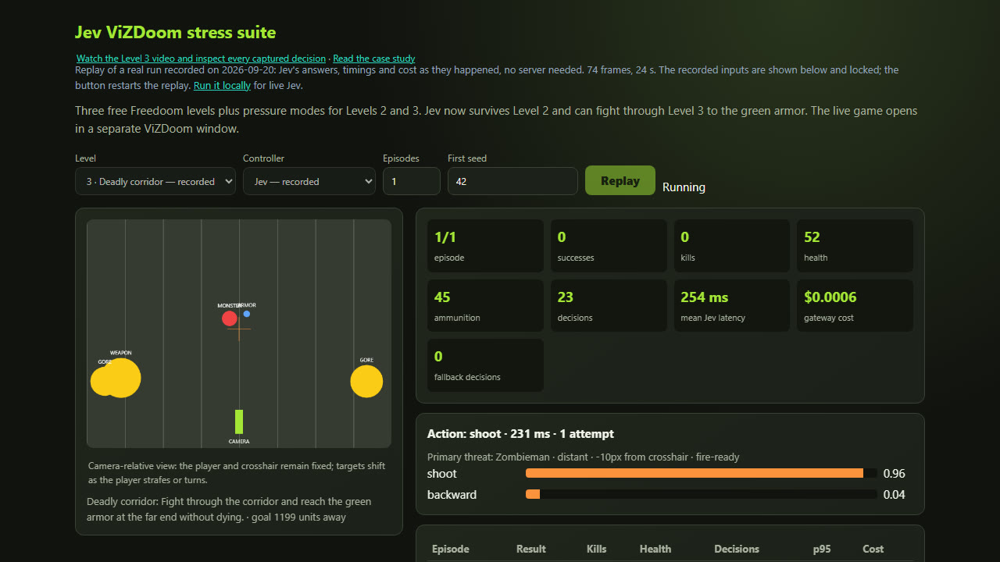
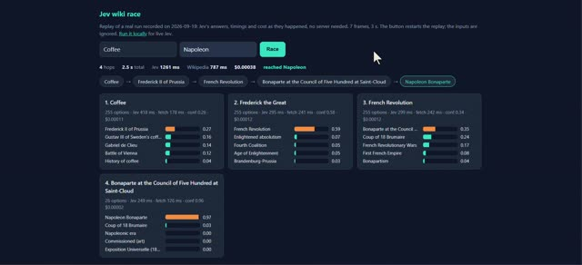
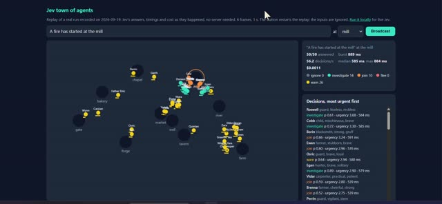
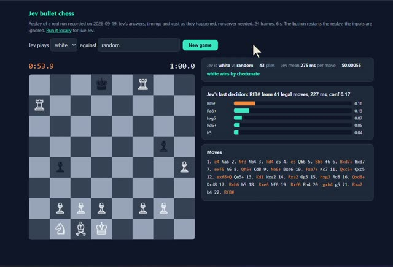
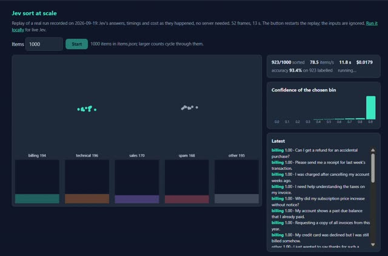

# Jev projects

Small demos of [Jev](https://docs.typesafe.ai/introduction), TypeSafe's decision model, reached through the [Vercel AI Gateway](https://vercel.com/ai-gateway) with one key. Each project is one Node file with the questions at the top, plus one HTML page that polls the server and draws the decisions. No framework, no build step.

The projects come from four YouTube videos about Jev (Matthew Berman, Ray Amjad, Witsam, and Nate Herk). Two earlier ones live in their own repos: the [model router](https://github.com/az9713/jev-model-router) and the [email triage](https://github.com/az9713/jev-email-triage).

## Featured: Jev plays ViZDoom

[](https://az9713.github.io/jev-projects/doom/video.html)

**Aim → survive → handle pressure → navigate → navigate under pressure.** Jev progressed from a one-target trainer to a combat corridor where it must kill enemies, preserve health and ammunition, and reach the armor objective. On 50 held-out Level 3 seeds it reached the goal **41 times**, with a **260 ms** median episode-mean decision latency, **346 ms** median episode p95, **zero fallbacks**, and **$0.00179** mean cost per run.

[Watch the Level 3 video and decision trace](https://az9713.github.io/jev-projects/doom/video.html) · [Open the interactive replay](https://az9713.github.io/jev-projects/doom/doom.html) · [Read the case study](doom/README.md) · [Inspect all Level 3 seeds](doom/corridor-evaluation.json)

- **Results page:** https://az9713.github.io/jev-projects/ — what each project shows, the measured numbers, and the findings.
- **Reliability upgrade:** https://az9713.github.io/jev-projects/reliability-upgrade.html — what changed, why it changed, how it works, and the new evaluation evidence.
- **Windows feasibility:** https://az9713.github.io/jev-projects/windows-feasibility.html — which unimplemented video projects can run on this machine, their real blockers, and the recommended build order.

## The one rule

Every page puts the measured latency on screen. The videos show demos from machines close to the model. From this machine one Jev decision takes 300 to 1,200 ms. A demo that hides that number is a demo of the animation, not of Jev.

## Projects

| Project | Page | Port | What Jev decides | Check result (2026-09-19) |
|---|---|---|---|---|
| `probe-burst.mjs` | – | – | Nothing; fires 50 calls at once | 48/50 ok, burst 7.8 s, median 1,230 ms per call |
| `wiki/` | [wiki race](https://az9713.github.io/jev-projects/wiki/wiki.html) | 3001 | Which of up to 255 links on a Wikipedia page leads to the target | 5/5 races Coffee → Napoleon, 4 to 7 hops, 2.3 to 5.7 s |
| `town/` | [town of agents](https://az9713.github.io/jev-projects/town/town.html) | 3002 | What each of 50 characters does when an event is announced, all in one burst | 50/50 answered in 2.7 to 10 s; the wolf raises 21 flee+warn, free bread 3 |
| `chess/` | [bullet chess](https://az9713.github.io/jev-projects/chess/chess.html) | 3003 | Which legal move to play, on a one-minute clock | 5 wins, 5 draws, 0 losses in 10 games vs a random mover; 465 ms per move |
| `sort/` | [sort at scale](https://az9713.github.io/jev-projects/sort/sort.html) | 3004 | Which of five queues a customer message belongs in, 20 calls in flight | 303 items in 13.8 s, 21.9 items/s, 93.7% agreement with the labels |
| `logs/` | [log monitor](https://az9713.github.io/jev-projects/logs/logs.html) | 3005 | Severity 0 to 3, page-the-on-call boolean, and subsystem, per log line | 20 incidents in 2,020 lines: no overlap with routine lines; page fired on 18/20 |
| `lane/` | [lane sim](https://az9713.github.io/jev-projects/lane/lane.html) | 3006 | Forward, ease left, ease right, brake, or stop, once per 1 s tick | 5 runs: Jev 13 collisions, forward-only 20, rules 0. Spec target (< 3) not met |
| `doom/` | [ViZDoom stress suite](https://az9713.github.io/jev-projects/doom/doom.html) | 3007 | Aim, defend, and navigate a combat corridor, each with harder pressure modes | Level 2: 50/50 final survival. Level 3: 41/50 reached the armor with median 6 kills, zero fallbacks and $0.00179 mean cost; corridor pressure: 8/10 |
| `hooks/skill-router.mjs` | – | – | Which of your Claude Code skills fits the prompt | 6/6 test prompts, 147 skills as options, 9.9k tokens, $0.0004 per prompt |
| `hooks/verify.mjs` | – | – | 12 yes/no and score questions about a git diff | secret, test_weakened, debug_left fired on the synthetic diff; risk 2.99 of 3 |

### Folder rule

- Each implemented application gets one top-level folder such as `doom/` or `minecraft/`; future projects do not get empty scaffolding.
- A visual application's publishable replay mirrors that folder under `docs/<name>/`.
- Shared Jev calls, retries, timing, and cost stay in `lib.mjs`. A project adds a language bridge only when its runtime requires one.
- Local runtimes such as `doom/.venv/` and credentials remain ignored; source, pinned dependencies, checks, and measured replays are committed.

### Videos

Screen recordings of five pages, 5 to 27 s each, silent. Click a picture to play the video or its dedicated watch page.

<table>
<tr>
<td width="50%"><a href="https://az9713.github.io/jev-projects/video/jev_wiki_race.mp4"></a><br><b>Wiki race</b>, 5 s: Coffee to Napoleon in 4 hops</td>
<td width="50%"><a href="https://az9713.github.io/jev-projects/video/jev_town.mp4"></a><br><b>Town of agents</b>, 14 s: 50 characters react to a fire at the mill</td>
</tr>
<tr>
<td width="50%"><a href="https://az9713.github.io/jev-projects/video/jev_chess.mp4"></a><br><b>Bullet chess</b>, 12 s: Jev as white against a random mover</td>
<td width="50%"><a href="https://az9713.github.io/jev-projects/video/jev_sort.mp4"></a><br><b>Sort at scale</b>, 18 s: 1000 messages into five queues</td>
</tr>
<tr>
<td colspan="2"><a href="https://az9713.github.io/jev-projects/doom/video.html"></a><br><b>ViZDoom Level 3</b>, 24 s: six kills, 52 health, 76 decisions, 261 ms mean decision latency and no fallback. The linked GitHub Page includes the video, full performance explanation and 73 captured decision snapshots.</td>
</tr>
</table>

The **Page** links open each project's own HTML on GitHub Pages. Pages has no Node server and no gateway key, so each page there replays one real run recorded on 2026-09-19 or 2026-09-20: the same page, fed the `/state` frames that were recorded, with Jev's real answers, timings, and cost. The button restarts the replay. `node record.mjs [name]` records a fresh run into `docs/<name>/<name>.html`.

## One real call per project

Captured on 2026-09-19 for the [development journey](https://az9713.github.io/jev-projects/journey.html), which shows the full request and response for each row. The skill-router time includes one gateway 503 burst and a 5 s retry wait.

| Tab | Example | Answer | Confidence | Time | Cost |
|---|---|---|---|---|---|
| probe-burst | n = 3 | even 0.01 | none for booleans | 319 ms | $0.0000116 |
| wiki | Coffee → Napoleon, first hop | Gabriel de Clieu | 0.17 | 293 ms | $0.000109 |
| chess | start position, 20 moves | e4 | 0.69 | 309 ms | $0.0000204 |
| town | Mara the baker, free bread | join, urgency 1.11 | 0.59, 0.69 | 237 ms | $0.000023 |
| sort | items.json[0] | billing | 1.00 | 235 ms | $0.0000193 |
| logs | "connection pool exhausted" | severity 2.02, page 0.81, db | 0.96, 1.00 | 2,480 ms | $0.0000248 |
| lane | cone 3 lengths ahead, speed 2 | ease_right, danger 2.6 | 0.47, 0.60 | 300 ms | $0.0000276 |
| Doom Level 3 | Zombieman right, 62 px off crosshair | turn_right | 0.85 | 465 ms | $0.0000269 |
| skill-router | "wrap up my day", 147 skills | end-of-day-wrapup | 1.00 | 12,435 ms | $0.000417 |
| verify | the synthetic diff | secret 0.99, test_weakened 0.99, debug_left 0.98 | risk 1.00 | 336 ms | $0.0000345 |

## Run

Needs Node 20.6 or later and a Vercel AI Gateway key on the paid tier.

```
npm install
echo AI_GATEWAY_API_KEY=your_key > .env
node --env-file=.env wiki/wiki.mjs          # http://localhost:3001, same shape for town, chess, sort, logs, lane
node --env-file=.env chess/chess.mjs --check   # every project has a --check that asserts its proof condition
node --env-file=.env probe-burst.mjs 50
py -3.13 -m venv doom/.venv
doom/.venv/Scripts/python -m pip install -r doom/requirements.txt
doom/.venv/Scripts/python doom/doom.py --check  # free ViZDoom rules-vs-random check
doom/.venv/Scripts/python doom/doom.py          # http://localhost:3007
doom/.venv/Scripts/python doom/doom.py --run jev --scenario defend --episodes 1 --headless
doom/.venv/Scripts/python doom/doom.py --run rules --scenario defend --episodes 100 --seed 1000 --headless
doom/.venv/Scripts/python doom/benchmark.py  # development, validation, final and pressure gates
doom/.venv/Scripts/python doom/benchmark.py corridor
```

`town/town.json` and `sort/items.json` were written once by `anthropic/claude-sonnet-5` (`--gen`) and are committed, so runs are reproducible.

`npm test` runs the free shared-evaluator checks and six held-out verifier cases. `npm run eval:live` runs those cases against Jev and saves the common JSONL result format under `eval/`. For a browser flow, start `node --env-file=.env lane/lane.mjs --tick 10`, then run `python tests/browser.py`; it drives the rule-based path without spending gateway credit.

### The two hooks are not installed

`hooks/skill-router.mjs --hook` reads a UserPromptSubmit event and prints "Use skill X" when Jev's top pick is above 0.5. `hooks/verify.mjs --hook` reads a PostToolUse event for Edit or Write and prints the questions that fired for that file's diff. Each adds 300 to 1,000 ms to every prompt or edit. To install one, add it to `~/.claude/settings.json` yourself, for example:

```json
"UserPromptSubmit": [{ "hooks": [{ "type": "command", "command": "node --env-file=C:/Users/you/Downloads/jev-projects/.env C:/Users/you/Downloads/jev-projects/hooks/skill-router.mjs --hook" }] }]
```

## Findings

- **Parallel bursts work, with a tail.** 50 calls at once: 48 returned in a median of 1,230 ms; two got 503 three times in a row. The gateway also returns short 503 bursts in sequential runs. `lib.mjs` retries four more times at 3, 6, 12, and 24 s.
- **The SDK rejects a rounding tie.** `ai` 7.0.107 can throw `AI_InvalidResponseDataError` when the displayed probabilities round past the chosen option. The shared evaluator now reports that call as a failure instead of silently treating partial error data as a successful zero-cost answer.
- **255 options is a hard cap.** 255 accepted, 256 refused. Empty-string descriptions are accepted; Jev reads the option name. On 255 fake titles plus "Napoleon Bonaparte", it picked the right one at p 0.97 in 337 ms.
- **Batch-and-wait halves throughput.** Sorting in batches of 20 ran at 3.5 items/s because each batch waited for its slowest call (5 to 7 s tail). Twenty workers pulling from a queue ran at 21.9 items/s.
- **"Investigate" is the town's default.** For both "Free bread at the bakery" and "A wolf is at the gate", the modal action was investigate (36 and 29 of 50). The events differ in the tails: the wolf gets flee and warn, the bread gets join.
- **Jev's severity scale is compressed.** Only 12 of 20 incidents scored above 2.0 on the 0 to 3 scale. But the highest routine line scored 1.37 and the lowest incident 1.47, so a threshold at 1.4 separates them completely on this data.
- **Jev drives badly from text.** On the 60-tick road with 17 obstacles, Jev collided 29 times in 5 runs. Precomputing `ticks_to_impact` cut it to 13 to 16. A driver that only goes forward: 20. The rule-based driver with the same information: 0. Jev does not do the arithmetic; it reads.
- **The gateway has slow hours.** The same 2,020-line log check took 119 s at 10:00 and 573 s at 10:30, with 0 failures both times; one lane run averaged 8.6 s per decision in that window. The 503-burst retries in `lib.mjs` kept every answer, at the price of wall time. Both numbers are on the results page.
- **Labels are one model's opinion.** Sort accuracy moved from 88.1% to 93.7% by rewriting the rubric for sales and billing, not by changing Jev. Most misses were between sales, billing, and other.
- **Chess: no losses to random.** Five checkmates and five draws in 10 games; two draws hit the 200-ply cap. Jev never played an illegal move because the options are the legal moves.

## Not built, and why

- Doom is now implemented with ViZDoom and its bundled Freedoom assets. Minecraft is confirmed buildable: this machine has Node 22, Java 23, Python 3.13, WSL 2, 31.7 GiB RAM, and enough disk. Melee is conditional on a legally obtained NTSC 1.02 game image and Slippi setup. A full CARLA driving replica is unsuitable here because the RTX 3050 Laptop GPU has 4 GiB VRAM; CARLA documents 6 GiB as a minimum and recommends 8 GiB. See the [Windows feasibility report](https://az9713.github.io/jev-projects/windows-feasibility.html).
- Live versions of the X-feed classifier, YouTube/community routing, meetings, contracts, job/lead screening, brain-dump routing, customer support, and Sentry need the relevant account or private input stream. Their decision pipelines can all be built and evaluated locally with fixtures first.
- Real-money trading is deliberately excluded. A replay or paper-trading experiment is feasible, but neither video establishes predictive value, and the decision model should be evaluated for calibration before any execution layer exists.
- The wiki "race" lane against a chat model: not built. Chess against a chat model: wired (type a gateway model id in the page's opponent field, 10 s budget per move) but not measured.
- The skill router's 30-prompt evaluation against real transcripts: not done; the six-prompt check stands in.
