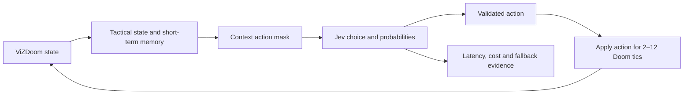

# Jev plays ViZDoom

This project asks a concrete systems question: **can a small, fast decision model control a game agent through combat and navigation while exposing its latency, confidence, cost, and failures?**

[Watch the Level 3 video](https://az9713.github.io/jev-projects/doom/video.html) · [Open the interactive replay](https://az9713.github.io/jev-projects/doom/doom.html) · [Inspect the recorded decision trace](https://az9713.github.io/jev-projects/doom/decision-trace.json)

## The progression

| Level | Jev must decide | What it tests |
|---|---|---|
| 1 · Aim trainer | `left`, `right`, `shoot` | Basic perception-to-action alignment |
| 2 · Defend the center | `turn_left`, `turn_right`, `shoot` | Target tracking, ammunition discipline, survival and short-term memory |
| 2B · Defend under pressure | Adds turn-and-shoot actions | Partial observation, longer survival and a larger action set |
| 3 · Deadly corridor | Turn, shoot, advance, retreat or strafe | Combat followed by goal-directed navigation |
| 3B · Corridor under pressure | The same actions with fewer visible targets and less time | Robustness under partial observation and a tighter clock |

## Level 3 result

Jev receives a compact tactical state rather than raw pixels. It sees health, ammunition, kills, visible targets, crosshair error, target range, goal distance and bearing, recent progress, and short-term memory. It then chooses one context-appropriate high-level action.

| Evaluation split | Seeds | Goal reached | Median kills | Median episode mean latency | Median episode p95 | Mean cost | Fallbacks |
|---|---:|---:|---:|---:|---:|---:|---:|
| Development | 400–409 | 9/10 | 6 | 252 ms | 339 ms | $0.001732 | 0 |
| Validation, policy frozen | 500–519 | 16/20 | 6 | 248 ms | 322 ms | $0.001826 | 0 |
| Final held-out | 1500–1549 | **41/50** | **6** | **260 ms** | **346 ms** | **$0.001786** | **0** |
| Pressure | 4000–4009 | 8/10 | 6 | 262 ms | 365 ms | $0.001732 | 0 |

The result files retain every seed rather than only successful examples:

- [`corridor-evaluation.json`](corridor-evaluation.json): Level 3 rule baseline, development, validation, final and pressure runs.
- [`jev-evaluation.json`](jev-evaluation.json): Level 2 development, validation, final and pressure runs.
- [`decision-trace.json`](decision-trace.json): the public seed-42 replay, with each captured action, latency, selected probability and tactical reason.

## What the decisions are

The Python game wrapper constructs an action mask from the current tactical state. Jev chooses among the actions that are useful in that state; it cannot invent an unsupported command.

| Decision | Meaning | When it is offered |
|---|---|---|
| `turn_left`, `turn_right` | Rotate toward a locked monster or toward the goal bearing | The target or goal is off-center |
| `shoot` | Fire at the locked monster | The target is within 15 pixels of the crosshair |
| `forward` | Advance through the corridor | No monster is locked and the goal is within 8° of the view direction |
| `strafe_left`, `strafe_right` | Reposition without changing the viewing direction | Movement or obstacle recovery makes lateral motion useful |
| `backward` | Retreat from a close centered threat | A fire-ready monster is directly ahead |

The successful public run made 76 decisions in 24 seconds: it killed six monsters, reached the armor with 52 health, used no fallback, and cost $0.001953. The page recorder captured 73 distinct decision snapshots: 27 `shoot`, 22 `forward`, 14 `turn_right`, and 10 `turn_left`. Decisions 27, 31 and 45 completed between two 250 ms page polls, so their latency is retained in the run totals but their action snapshots are not reconstructed.

## Why a roughly 260 ms decision is fast enough here

Jev does not choose every rendered video frame. One high-level decision is held for several Doom tics: corridor turns normally last two tics, movement lasts eight, and a shot lasts twelve. This reduces remote calls while the game engine handles continuous motion and weapon mechanics.

The latency shown is wall-clock time inside the shared `ask()` call, including gateway/model time and any retry wait. The final held-out set had a 260 ms median of per-episode mean latency and a 346 ms median of per-episode p95 latency. These are quarter-second tactical decisions, not 60 Hz motor control. The game loop waits synchronously for each answer, so this experiment tests rapid sequential judgment rather than an asynchronous real-time shooter bot.

## How the controller works



Target locking prevents oscillation between enemies. Goal bearing tells the agent which way to turn after combat. Stuck detection notices repeated forward actions without progress. Action masking prevents wasteful choices such as shooting when no target is aligned. A deterministic rule controller first established that the task was solvable, reaching the goal on 88/100 seeds.

## Run on Windows

From the repository root:

```powershell
py -3.13 -m venv doom/.venv
doom/.venv/Scripts/python -m pip install -r doom/requirements.txt
doom/.venv/Scripts/python doom/doom.py --check
doom/.venv/Scripts/python doom/doom.py
```

Open `http://localhost:3007`. Rule and random controllers are free. The Jev controller also needs the repository `.env` file with `AI_GATEWAY_API_KEY`.

Run the evaluation gates with:

```powershell
doom/.venv/Scripts/python doom/benchmark.py
doom/.venv/Scripts/python doom/benchmark.py corridor
```

## Evidence boundary

The GitHub Pages replay and video show one successful seed-42 run. The 82% completion claim comes from the separate 50-seed final evaluation, including all nine failures. Jev chooses from a wrapper-generated action mask and receives structured state; it does not interpret raw game pixels. GitHub Pages cannot run ViZDoom or safely store the gateway key, so live decisions require the local application.
